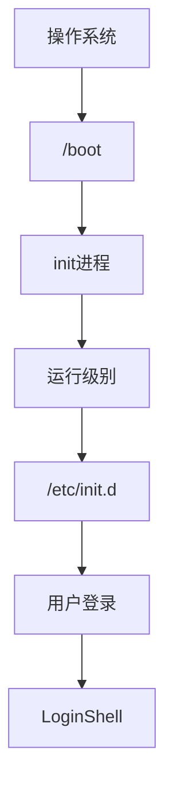

> 初级阶段：
> 1． 命令是必须要学的，linux常用的命令大概在80个左右，这些常用命令一定要熟练掌握。
> 2． 掌握linux软件包的常用安装方法，例如源码安装，rpm方式安装等等。
> 3． 学习安装设备驱动程序（比如网卡、显卡驱动）
> 4． 熟悉Grub/Lilo引导程序及简单的修复操作。
> 5． 熟悉Linux文件系统和目录结构以及linux基本运行原理。
> 6． 掌握vi，gcc，gdb等常用编辑器，编译器，调试器。
> 7． 理解shell别名、管道、I/O重定向、输入和输出以及shell简单脚本编程。
> 8． 学习Linux环境下的网络基本组建。
>
> 高级阶段:
> 1:尝试阅读linux内核源码：
> 这需要具有一定的C、C++语言基础，因为C、C++是linux/unix的核心语言，系统代码都是C写的。
> 2:尝试编译安装和调试自己的linux内核：
> 在阅读源码了解了linux底层的运行原理后，完全可以编译一个适合自己的linux系统来。
> 3:深入学习shell， perl，cgi等脚本语言：
> 这些脚本语言在linux下非常强大，它们能完成你想做的任何事情，熟练掌握这些语言，可以让你在linux系统下游刃有余，如鱼得水。
> 4:构建企业级linux高可用集群系统：linux下有很多开源免费的集群软件，利用这些免费的集群软件完全可以构建出与商业unix系统想媲美的集群系统来。

## 1 Linux的基础入门知识

### 1.1 简介

> Linux内核最初只是由芬兰人**李纳斯·托瓦兹（Linus Torvalds）**在赫尔辛基大学上学时出于个人爱好而编写的。
>
> Linux是一套免费使用和自由传播的类Unix操作系统，是一个基于POSIX和UNIX的多用户、多任务、支持多线程和多CPU的操作系统。
>
> Linux能运行主要的UNIX工具软件、应用程序和网络协议。它支持32位和64位硬件。Linux继承了Unix以网络为核心的设计思想，是一个性能稳定的多用户网络操作系统。

- 发行版，比如即将使用的centos，就是linux的内核和应用软件的一个打包

### 1.2 安装

> 本章节以 centos6.4 为例。
>
> centos 下载地址：
>
> - 网易镜像：http://mirrors.163.com/centos/
> - 搜狐镜像：http://mirrors.sohu.com/centos/
>
> **注：**建议安装64位Linux系统。
>
> 接下来你需要将下载的Linux系统刻录成光盘或U盘。
>
> **注：**你也可以在Window上安装VMware虚拟机来安装Linux系统。

- 额，高达27步骤
- 主要有
  - 网络设置
  - 时区设置
  - root账户
  - 硬盘分区（感觉最关键的一步）
  - 调整分区
  - 最小化桌面

### 1.3 linux系统启动过程



- BIOS开机自检，启动硬盘；

- 操作系统接管硬件之后，首先读取/boot目录下的内核文件

- 然后运行init进程，配置文件是/etc/inittab

- 运行级别

  > 许多程序需要开机启动。它们在Windows叫做"服务"（service），在Linux就叫做"守护进程"（daemon）。
  >
  > init进程的一大任务，就是去运行这些开机启动的程序。
  >
  > 但是，不同的场合需要启动不同的程序，比如用作服务器时，需要启动Apache，用作桌面就不需要。
  >
  > Linux允许为不同的场合，分配不同的开机启动程序，这就叫做"运行级别"（runlevel）。也就是说，启动时根据"运行级别"，确定要运行哪些程序。

- 系统初始化，即运行init.d，位置通常在/etc/rc.d/rc5.d/，但实际工作碰到其他地方的，是系统调整之后的结果，比如/etc/init.d/

- 用户登录

- 界面切换

### 1.4 远程登录

- 确认服务端有安装ssh并且开放端口22
- ssh软件远程连接
- 用户和密码
- 如果要用密钥认证，就需要生成，放在服务器对应位置了

### 1.5 系统目录结构

树状目录结构，根目录是/

- **/bin**：
  **bin是Binary的缩写, 这个目录存放着最经常使用的命令**。

- **/boot：**
  这里存放的是启动Linux时使用的一些核心文件，包括一些连接文件以及镜像文件。

- **/dev ：**
  dev是Device(设备)的缩写, 该目录下存放的是Linux的外部设备，在Linux中访问设备的方式和访问文件的方式是相同的。

- **/etc：**
  这个目录用来存放**所有的系统管理所需要的配置文件和子目录**。

- **/home**：
  **用户的主目录**，在Linux中，每个用户都有一个自己的目录，一般该目录名是以用户的账号命名的。

- **/lib**：
  这个目录里存放着系统最基本的**动态连接共享库**，其作用类似于Windows里的DLL文件。几乎所有的应用程序都需要用到这些共享库。

- **/lost+found**：
  这个目录一般情况下是空的，当系统非法关机后，这里就存放了一些文件。

- **/media** linux系统会自动识别一些设备，例如U盘、光驱等等，当识别后，linux会把识别的设备挂载到这个目录下。

- **/mnt**：
  系统提供该目录是为了让用户临时挂载别的文件系统的，我们可以将光驱挂载在/mnt/上，然后进入该目录就可以查看光驱里的内容了。

- **/opt**：
  这是给主机额外安装软件所摆放的目录。比如你安装一个ORACLE数据库则就可以放到这个目录下。默认是空的。

- **/proc**：
  这个目录是一个虚拟的目录，它是系统内存的映射，我们可以通过直接访问这个目录来获取系统信息。
  这个目录的内容不在硬盘上而是在内存里，我们也可以直接修改里面的某些文件，比如可以通过下面的命令来屏蔽主机的ping命令，使别人无法ping你的机器：

  ```
  echo 1 > /proc/sys/net/ipv4/icmp_echo_ignore_all
  ```

- **/root**：
  该目录为系统管理员，也称作超级权限者的用户主目录。

- **/sbin**：
  s就是Super User的意思，这里存放的是系统管理员使用的系统管理程序。

- **/selinux**：
  这个目录是Redhat/CentOS所特有的目录，Selinux是一个安全机制，类似于windows的防火墙，但是这套机制比较复杂，这个目录就是存放selinux相关的文件的。

- **/srv**：
  该目录存放一些服务启动之后需要提取的数据。

- **/sys**：
  这是linux2.6内核的一个很大的变化。该目录下安装了2.6内核中新出现的一个文件系统 sysfs 。

  sysfs文件系统集成了下面3种文件系统的信息：针对进程信息的proc文件系统、针对设备的devfs文件系统以及针对伪终端的devpts文件系统。

  该文件系统是内核设备树的一个直观反映。

  当一个内核对象被创建的时候，对应的文件和目录也在内核对象子系统中被创建。

- **/tmp**：
  这个目录是用来存放一些临时文件的。

- **/usr**：
  **这是一个非常重要的目录，用户的很多应用程序和文件都放在这个目录下，类似与windows下的program files目录。**

- **/usr/bin：**
  系统用户使用的应用程序。

- **/usr/sbin：**
  超级用户使用的比较高级的管理程序和系统守护程序。

- **/usr/src：**内核源代码默认的放置目录。

- **/var**：
  **这个目录中存放着在不断扩充着的东西，我们习惯将那些经常被修改的目录放在这个目录下。包括各种日志文件。**

总结下：

- 重点关注

  - /var:日志文件等多变文件
  - /home：用户的根目录，或者是/home/username，用户的文件就在这个下面
  - /etc：偶尔需要关注的目录，查看配置或者修改配置的时候
  - /lib：相当于program files，所以查看安装了哪些东西可以来这里看

- 系统层面，需要注意

  > 在linux系统中，有几个目录是比较重要的，平时需要注意不要误删除或者随意更改内部文件。
  >
  > /etc： 上边也提到了，这个是系统中的配置文件，如果你更改了该目录下的某个文件可能会导致系统不能启动。
  >
  > /bin, /sbin, /usr/bin, /usr/sbin: 这是系统预设的执行文件的放置目录，比如 ls 就是在/bin/ls 目录下的。
  >
  > 值得提出的是，/bin, /usr/bin 是给系统用户使用的指令（除root外的普通用户），而/sbin, /usr/sbin 则是给root使用的指令。
  >
  > /var： 这是一个非常重要的目录，系统上跑了很多程序，那么每个程序都会有相应的日志产生，而这些日志就被记录到这个目录下，具体在/var/log 目录下，另外mail的预设放置也是在这里。